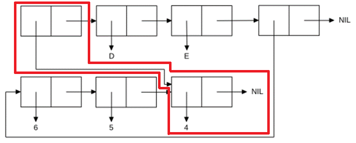

<p align="center"><b>МОНУ НТУУ КПІ ім. Ігоря Сікорського ФПМ СПіСКС</b></p>
<p align="center">
<b>Звіт з лабораторної роботи 1</b>
<p align="center">
<br>"Обробка списків з використанням базових функцій"</br>
з дисципліни "Вступ до функціонального програмування"
</p>

<div style="display: flex; justify-content: flex-end;">
  <div style="border: 0px; padding: 10px;">
    <p>Студент: Терентьєв Іван Дмитрович</p>
    <p>Група: КВ-11</p>
    <p>Рік: 2024</p>
  </div>
</div>


## Загальне завдання
1. Створіть список з п'яти елементів, використовуючи функції LIST і CONS . Форма створення списку має бути одна — використання SET чи SETQ (або інших допоміжних форм) для збереження проміжних значень не допускається. Загальна кількість елементів (включно з підсписками та їх елементами) не має перевищувати 10-12 шт. (дуже великий список робити не потрібно). Збережіть створений список у якусь змінну з SET або SETQ . Список має містити (напряму або у підсписках): 
* хоча б один символ 
* хоча б одне число 
* хоча б один не пустий підсписок
* хоча б один пустий підсписок 
2. Отримайте голову списку. 
3. Отримайте хвіст списку. 
4. Отримайте третій елемент списку. 
5. Отримайте останній елемент списку. 
6. Використайте предикати ATOM та LISTP на різних елементах списку (по 2-3 приклади для кожної функції). 
7. Використайте на елементах списку 2-3 інших предикати з розглянутих у розділі 4 навчального посібника. 
8. Об'єднайте створений список з одним із його непустих підсписків. Для цього використайте функцію APPEND. 


```lisp
(defvar my-list nil)
(setq my-list
    (cons 'x
          (cons 7
                (cons 'y
                      (cons (list 'a 'b)
                            (list 'z (list 42 43) nil))))))
(format t "~%1. Printing my-list")
(print my-list)
(format t "~%2. Printing head of my-list")
(print (car my-list))
(format t "~%3. Printing tail of my-list")
(print (cdr my-list))
(format t "~%4. Printing third element of my-list")
(print (nth 2 my-list))
(format t "~%5. Printing last element of my-list")
(print (car (last my-list)))
(format t "~%6.1.1 Printing check ATOMarity of first element of my-list => 'X' ")
(print (atom (car my-list)))
(format t "~%6.1.2 Printing check ATOMarity of fourth element of my-list => '(A B)' ")
(print (atom (nth 3 my-list)))
(format t "~%6.1.3 Printing check ATOMarity of last element of my-list 'NIL' ")
(print (atom (car (last my-list))))
(format t "~%6.2.1 Printing check LISTParity of first element of my-list => 'X' ")
(print (listp (car my-list)))
(format t "~%6.2.2 Printing check LISTParity of fourth element of my-list => '(A B)' ")
(print (listp (nth 3 my-list)))
(format t "~%6.2.3 Printing check LISTParity of last element of my-list 'NIL' ")
(print (listp (car (last my-list))))
(format t "~%7.1.1 Printing check EQLarity of first element of my-list => 'X' and 'x' ")
(print (eql (car my-list) 'x))
(format t "~%7.1.2 Printing check EQLarity of second element of my-list => '7' and 7.0 ")
(print (eql (second my-list) 7.0))
(format t "~%7.1.3 Printing check EQLarity of fourth element of my-list => '(A B)' and (A B) ")
(print (eql (nth 3 my-list) '('a 'b)))
(format t "~%7.2.1 Printing check NULLarity of first element of my-list => 'X' ")
(print (eql (car my-list) 'x))
(format t "~%7.2.2 Printing check NULLarity of fourth element of my-list => '(A B)' ")
(print (eql (nth 3 my-list) 7.0))
(format t "~%7.2.3 Printing check NULLarity of last element of my-list 'NIL' ")
(print (eql (car (last my-list)) '('a 'b)))
(format t "~%7.3.1 Printing check EQUALParity of first element of my-list => 'X' and x ")
(print (equalp (car my-list) 'x))
(format t "~%7.3.2 Printing check EQUALParity of second element of my-list => '7' and 7.0 ")
(print (equalp (second my-list) 7.0))
(format t "~%7.3.3 Printing check EQLUALParity of fourth element of my-list => '(A B)' and (A B) ")
(print (equalp (nth 3 my-list) (list 'a 'b)))
(format t "~%8. Printing appended my-list with fourth element of my list => '(A B)' ")
(print (append my-list (nth 3 my-list)))
```
## Завдання за варіантом №6
Створіть список, що відповідає структурі списку, наведеній на рисунку (за варіантом). Для цього допускається використання не більше двох форм. Номер варіанту обирається як номер у списку групи, який надсилає викладач на початку семестру (на випадок, якщо протягом семестру стануться зміни в складі групи), за модулем 8: 1 -> 1, 2 - > 2, ..., 9 -> 1, 10 -> 2, ... 
Примітка: на рисунках однакові імена символів можуть бути позначені в кількох місцях, проте, загалом, вони позначають один і той самий символ. 
<p align="center">

</p>

```lisp
(format t "~%9. Resolving task, variant number 22 => 22mod8 => 6")
(defvar list-six nil)
(defvar include-in-six nil)
(setq include-in-six '(6 5 4)
  list-six (cons (car (last include-in-six))
                 (cons 'd (list 'e include-in-six))))
(print list-six)
```

## Результат виконання програми
```
1. Printing my-list
(X 7 Y (A B) Z (42 43) NIL) 
2. Printing head of my-list
X 
3. Printing tail of my-list
(7 Y (A B) Z (42 43) NIL) 
4. Printing third element of my-list
Y 
5. Printing last element of my-list
NIL 
6.1.1 Printing check ATOMarity of first element of my-list => 'X' 
T 
6.1.2 Printing check ATOMarity of fourth element of my-list => '(A B)' 
NIL 
6.1.3 Printing check ATOMarity of last element of my-list 'NIL' 
T 
6.2.1 Printing check LISTParity of first element of my-list => 'X' 
NIL 
6.2.2 Printing check LISTParity of fourth element of my-list => '(A B)' 
T 
6.2.3 Printing check LISTParity of last element of my-list 'NIL' 
T 
7.1.1 Printing check EQLarity of first element of my-list => 'X' and 'x' 
T 
7.1.2 Printing check EQLarity of second element of my-list => '7' and 7.0 
NIL 
7.1.3 Printing check EQLarity of fourth element of my-list => '(A B)' and (A B) 
NIL 
7.2.1 Printing check NULLarity of first element of my-list => 'X' 
T 
7.2.2 Printing check NULLarity of fourth element of my-list => '(A B)' 
NIL 
7.2.3 Printing check NULLarity of last element of my-list 'NIL' 
NIL 
7.3.1 Printing check EQUALParity of first element of my-list => 'X' and x 
T 
7.3.2 Printing check EQUALParity of second element of my-list => '7' and 7.0 
T 
7.3.3 Printing check EQLUALParity of fourth element of my-list => '(A B)' and (A B) 
T 
8. Printing appended my-list with fourth element of my list => '(A B)' 
(X 7 Y (A B) Z (42 43) NIL A B) 
9. Resolving task, variant number 22 => 22mod8 => 6
(4 D E (6 5 4)) 
```


## Деякі операції LISP

| Операція Lisp    | Короткий опис                                        | Приклад використання                         |
|------------------|------------------------------------------------------|----------------------------------------------|
| `setq`           | Присвоює значення змінній без необхідності цитування символу | `(setq my-var 10)`                           |
| `cons`           | Додає елемент на початок списку                       | `(cons 'a '(b c)) ;; => (a b c)`             |
| `list`           | Створює список із заданих елементів                   | `(list 'a 42 '(b c) nil) ;; => (a 42 (b c) nil)` |
| `car`            | Повертає перший елемент списку                        | `(car '(a b c)) ;; => a`                     |
| `cdr`            | Повертає список без першого елемента (хвіст)          | `(cdr '(a b c)) ;; => (b c)`                 |
| `nth`            | Повертає n-й елемент списку                           | `(nth 2 '(x y z)) ;; => z`                   |
| `nthcdr`         | Повертає хвіст списку, починаючи з n-го елемента      | `(nthcdr 2 '(x y z)) ;; => (z)`              |
| `last`           | Повертає останній елемент списку                      | `(car (last '(a b c))) ;; => c`              |
| `atom`           | Перевіряє, чи є елемент атомом                        | `(atom 'a) ;; => T`, `(atom '(a b)) ;; => NIL` |
| `listp`          | Перевіряє, чи є елемент списком                       | `(listp '(a b)) ;; => T`, `(listp 'a) ;; => NIL` |
| `eql`            | Порівнює два елементи на точну рівність               | `(eql 3 3) ;; => T`, `(eql 3 3.0) ;; => NIL` |
| `eq`             | Порівнює два елементи на фізичну рівність (ідентичність) | `(eq 'a 'a) ;; => T`, `(eq '(a) '(a)) ;; => NIL` |
| `equal`          | Порівнює два елементи на рівність вмісту              | `(equal '(a b) '(a b)) ;; => T`              |
| `equalp`         | Глибоке порівняння двох елементів                     | `(equalp '(a b) '(a b)) ;; => T`             |
| `null`           | Перевіряє, чи є елемент порожнім списком (`nil`)       | `(null nil) ;; => T`, `(null '(a b)) ;; => NIL` |
| `second`         | Повертає другий елемент списку                        | `(second '(a b c)) ;; => b`                  |
| `third`          | Повертає третій елемент списку                        | `(third '(a b c)) ;; => c`                   |
| `append`         | Об'єднує кілька списків в один                        | `(append '(a b) '(c d)) ;; => (a b c d)`     |
| `format`         | Виводить рядок або текст у відповідному форматі       | `(format t "Hello, World!~%") ;; => Hello, World!` |

## Особливість відносно читання структури списку
У методичних матеріалах не вказано, як саме читати випадки, де точкова пара посилається на іншу точкову пару, що має тільки CAR - символ чи цифра та CDR - NIL.
<p align="center">

</p>
Тому такі випадки були трактовані таким чином:

1. Якщо точкова пара має CAR - іншу точкову пару, що має CDR == NIL, то треба трактувати як символ.
2. Якщо точкова пара має CAR - іншу точкову пару, що має CDR != NIL, то треба трактувати як список.

## Відповіді на контрольні запитання
| Питання                                                                 | Відповідь                                                                                                                                           |
|-------------------------------------------------------------------------|-----------------------------------------------------------------------------------------------------------------------------------------------------|
| 1. Схарактеризуйте базові типи Common Lisp.                             | У Common Lisp є такі базові типи: числа (integer, float, ratio), символи, рядки, списки, масиви, функції, об'єкти, хеш-таблиці та булеві значення.   |
| 2. Що таке REPL?                                                        | REPL (Read-Eval-Print Loop) — це інтерактивне середовище для введення та виконання виразів у Lisp.                                                  |
| 3. Які є базові функції для роботи зі списками?                         | `car`, `cdr`, `cons`, `list`, `append`, `nth` — це базові функції для роботи зі списками.                                                           |
| 4. Які є базові функції для виконання арифметичних операцій?            | `+`, `-`, `*`, `/`, `mod` — функції для виконання додавання, віднімання, множення, ділення та взяття залишку.                                        |
| 5. Які є предикати для порівняння об'єктів в Common Lisp?               | `eq`, `eql`, `equal`, `equalp` — предикати для порівняння об'єктів у Common Lisp.                                                                  |
| 6. Як в Common Lisp реалізовані логічні операції?                       | Логічні операції в Common Lisp реалізовані через функції: `and`, `or`, `not`, `cond`.                                                                |
| 7. Що таке список, спискова комірка, точкова пара?                      | Список — це колекція елементів. Спискова комірка — структура з головою та хвостом. Точкова пара — це комірка, де другий елемент не є списком.        |
| 8. Що таке псевдофункія? Наведіть приклади псевдофункцій.               | Псевдофункція — це спеціальна форма, яка виглядає як функція, але не обчислює аргументи. Наприклад, `quote`.                                         |
| 9. В чому різниця між функцією, макросом та спеціальним оператором?     | Функція обчислює аргументи, макрос змінює код до виконання, спеціальні оператори мають особливі правила обчислення, наприклад, `if` чи `let`.        |
| 10. Наведіть приклади спеціальних операторів.                           | Приклади: `if`, `let`, `cond`, `lambda`, `quote`.                                                                                                   |
| 11. В чому різниця між конструктивним та руйнівним підходами до обробки списків? | Конструктивний підхід створює нові списки, а руйнівний змінює існуючі списки без створення копій, наприклад, `nconc`.                               |
| 12. Як можна відмінити обчислення або ж "виконати" форму?               | Відмінити обчислення можна за допомогою `quote`. "Виконати" форму можна за допомогою функції `eval`.                                                 |
